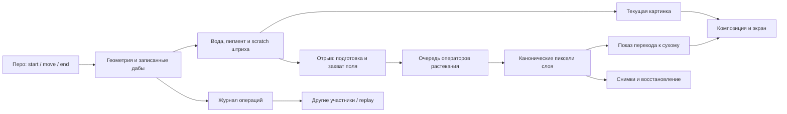

# Акварель: граница разбора после выпуска 6aa14a43

Это начальная схема для исследования, а не новая модель и не утверждение о завершённой плавности. Базовая версия: main6aa14a43. Новые эксперименты остановлены по просьбе Ильи.

| Звено | Исходники текущей версии | Что нужно отделить измерением |
|---|---|---|
| Ввод и дабы | engine/index.ts: _onStart/_onMove/_onEnd; PointerInput | физическое касание, обработчик, первый видимый кадр |
| Материал кисти | _paintDabs; RibbonStrokePainter | геометрия, копии источника, вода/пигмент, площадь кисти |
| Отрыв | _finishRibbonStroke; WatercolorSettlePlan.prepare; _diffuseFieldFor | allocation/clear/capture; CPU submission отдельно от GPU completion |
| Расчёт | WatercolorSettleQueue.start/tick; WatercolorPasses | число операторов, цена оператора, ожидание кадров, смена владельца поля |
| Переход | washReveal; LayerCompositor; _display | движение жидкости и визуальная интерполяция; независимость от canonical layer |
| Журнал и сеть | OperationLog; engineNetwork; server rooms | ACK, peer arrival, порядок, pending и очереди |
| Restore/undo | restoreRoomState; SnapshotIO; snapshotReplayLoader | загрузка сети, bitmap restore, replay, rebuild и display |

## Подтверждённые ориентиры и ограничения

- Narrow joinedTouch: пользователь Samsung подтвердил уменьшение задержки повторного касания; это включено в production. Не означает smooth400.
- Surface overlap candidate deferred: UP88.5→43.1ms/maxpostUP rAF1010→80.5ms при точных38полях/RGBA, но natural completion3.58→7.96s. CandidateOFF. Это native Engine input, не physicalpen-to-screen.
- Surface noOverlap: maxpostUP rAF866–960ms. Остаточная пауза не устраняется deferred. Повторные GPU clears — кандидат причины, аппаратной абляции ещё нет.
- Snapshot-free originalFine47: actual39paint/47append. Clear-prefix ускорение не включилось из-за parked watermark0; CPU исправление отдельно, аппаратная проверка ещё впереди.

## Порядок следующего разбора

Сначала сверить всю схему с исходниками выпущенной версии и показать Илье. Затем один общий сценарий400 на сухом листе и на воде с временной шкалой CPU/GPU/кадров. Каждая оптимизация — одно звено, один isolated вариант, проверка live/canonical/replay/undo и быстрая ручная оценка. Не заменять живой опыт сравнением только сухих картинок.
